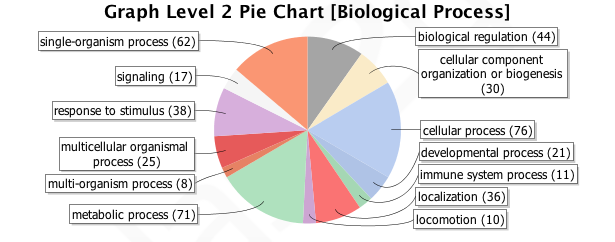

# Determining Gene Ontology with Large Sequence Libraries

For my project i embarked on a wonderful journey to shame my computer and eventually unlock the secrets that
RNA sequences hold. I began with a simple question that quickly evolved into a thought provoking and challenging
series of solutions which would test the very fabric of my computing soul. I enjoyed the journey very much
and learned a lot more than i could have imagined as a young 2nd quarter graduate student, though it seems 
like such a distant memory i would like to take the opportunity to regale you with my trials and triumphs through
the error ridden land of my computers CPU. 

My project had two main goals; Firstly, i wanted to gain comfortability with manipulating large datasets 
and gain insight into how to manipulate these unwieldy files, and get them to behave properly through 
my own very poorly written code. Secondly, i wanted to run all the way from sequence read outputs to 
mapping gene functions in order to get a hands on experience that would help me later when i construct
my own RNA libraries. 

# The data
I received 1.14 million RNA transcripts from a collaborator so that i can practice working through these 
huge datasets while still working on a close relative, and therefore applicable sister species to 
the one that i plan to study for my PhD. This fasta file needed to be trimmed down before further processing,
for i learned that cranking through 1 million sequences was easier said than done...

Example:
- **>contig00001  length=239  numreads=210  gene=isogroup00001  status=ig_thresh**
CAGGTACTAGAGTATGGTCTCGAAAGTAGAGCGTAGGGAAAGCCCTGCGCATGCGTATTCTCGATTCGGAGGCGCCAGTTGAGGGCG
- **>contig00002  length=244  numreads=4  gene=isogroup00001  status=ig_thresh**
TAAGTTTTTCACATCTTTTCTACTGTTCAGTACTAGATTGTTGGGATTCTGcGCATCCTTATTGTCTATTGATAACCcTTCCTTtGCT
- **>contig00003  length=1910  numreads=1812  gene=isogroup00001  status=ig_thresh**
AGTTCAAGGAGGCATTCTCACTCTTTGACAAAGATGGTGATGGCACCATTACTACTAAGGAGCTGGGTACTGTCATGAGGTCGCTGGG
- **>contig00004  length=1872  numreads=850  gene=isogroup00001  status=ig_thresh**
GCCCATTCAGACgCCAGCGGCCCGCAGACAGATACCAgccccTGTCCCGAAACAAGCGCACGGAGCACCGCGACGACGAGCAGGCACA


```{r, include=FALSE}
library("seqinr", lib.loc="/Library/Frameworks/R.framework/Versions/3.1/Resources/library")
library("ade4", lib.loc="/Library/Frameworks/R.framework/Versions/3.1/Resources/library")
library("ggplot2", lib.loc="/Library/Frameworks/R.framework/Versions/3.1/Resources/library")
setwd("~/Desktop/A.mexicanum-RNA/clusters")
amex_Tlen  <- read.table("amex_ClustLength.csv", header = TRUE, sep=",")

amex_NumSeq <- read.table("amex_LengthPlotting.csv", header = TRUE, sep=",")
aa <- amex_NumSeq
```

## 
```{r, warning=FALSE}
yy <- log(amex_Tlen[,2])
ggplot(as.data.frame(yy), aes(x=yy)) + geom_histogram(aes(y=..density..), binwidth=.2, color="black", fill="white") + geom_density(alpha=.2, fill="#FF6666") + ggtitle('All RNA Sequences') + theme(plot.title = element_text(size=20, face="bold", vjust=2))
```

# Clustering (CD-HIT)
I first downloaded some software (CD-HIT, command line of course) that contained some really clever
cluster recognition scripts, which could work through large datasets and remove redundant sequences 
that matched to a given specificity. This worked by creating "words" which were specified lengths
of code which it ran through all of the other sequences in order to get % similarity with every other fasta 
entry in the library. cd-hit then removed the similar sequences leaving only the the sequences that were at least 
95%, or 85% unique (done separately).


```python
# run the code on the actual mexicanum transcripts
  ./cd-hit-est -i 454ctgmexgt50.fas -o amex_cluster_90-100 -c 0.95 -n 8
  
	# run for less of a threshold
	./cd-hit-est -i 454ctgmexgt50.fas -o amex_cluster_80 -c 0.80 -n 5
```

```{r, warning=FALSE}
xx <- log(amex_Tlen[,3])
ggplot(as.data.frame(xx), aes(x=xx)) + geom_histogram(aes(y=..density..), binwidth=.2, color="black", fill="white") + geom_density(alpha=.2, fill="#FF6666") + ggtitle('RNA Sequences <95% similar') + theme(plot.title = element_text(size=20, face="bold", vjust=2))
```

```{r, warning=FALSE}
zz <- log(amex_Tlen[,4])
ggplot(as.data.frame(zz), aes(x=zz)) + geom_histogram(aes(y=..density..), binwidth=.2, color="black", fill="white") + geom_density(alpha=.2, fill="#FF6666") + ggtitle('RNA Sequences <80% similar') + theme(plot.title = element_text(size=20, face="bold", vjust=2))
```


```{r, echo=FALSE, warning=FALSE}
c <- ggplot(aa, aes(y= seq_count, x= factor(cluster, levels = c("Complete Sequence", "<95% Similar", "<80% Similar"))))
c + geom_bar(stat = "identity", fill="darkred", colour="black", width=.60) + labs(list(x = "Cluster Refinement", y = "Number of Remaining Sequences", title = "Removal of Repetitive Gene Transcripts")) + coord_cartesian(ylim=c(900000,1200000)) +  geom_text(aes(label = format(aa$seq_count, big.mark=",", scientific=FALSE), y = (seq_count * 1.02)), size = 7) + theme(plot.title = element_text(size=20, face="bold"))
```

## Sequences Removed
```{r, echo=FALSE, warning=FALSE}
c <- ggplot(aa, aes(y= diff, x= factor(cluster, levels = c("Complete Sequence", "<95% Similar", "<80% Similar"))))
c + geom_bar(stat = "identity", fill="darkgreen", colour="black", width=.60) + labs(list(x = "Cluster Refinement", y = "Number of Sequences Removed", title = "Repetitive Gene Transcripts Removed")) +  geom_text(aes(label = format(aa$diff, big.mark=",", scientific=FALSE), y = (diff - 10000)), size = 7) + theme(plot.title = element_text(size=20, face="bold"))
```


## Percent Removed
```{r, echo=FALSE, warning=FALSE}
c <- ggplot(aa, aes(y= rel_diff, x= factor(cluster, levels = c("Complete Sequence", "<95% Similar", "<80% Similar"))))
c + geom_bar(stat = "identity", fill="darkblue", colour="black", width=.60) + labs(list(x = "Cluster Refinement", y = "Percent of Sequences Removed", title = "Percent Repetitive Gene Transcripts Removed")) +  geom_text(aes(label = format(aa$rel_diff, big.mark=",", scientific=FALSE), y = (rel_diff - 0.25)), size = 7) + theme(plot.title = element_text(size=20, face="bold"))
```


## Install Biopython
```python
## If you want the documentation and unit tests,
sudo apt-get install python-biopython-doc

## And if you want to use BioSQL,
sudo apt-get install python-biopython-sql

```

## Translated these sequences to proteins
```python
from Bio.Seq import Seq
from Bio import SeqIO
from Bio.SeqRecord import SeqRecord

def translate_seq(input_file, output_file, input_file_type = "fasta", output_file_type = "fasta"):

    def make_protein_record(nuc_record):
        """Returns a new SeqRecord with the translated sequence (default table)."""
        return SeqRecord(seq = nuc_record.seq.translate(to_stop=True), \
            id = "trans_" + nuc_record.id, \
            description = "translation of CDS, using default table")
        
    proteins = (make_protein_record(nuc_rec) for nuc_rec in \
        SeqIO.parse(input_file, input_file_type))
    
    SeqIO.write(proteins, output_file, output_file_type)

```
## Sample proteins
**>trans_contig00001 translation of CDS**
QVLEYGLESRA
**>trans_contig00003 translation of CDS**
SSRRHSHSLTKMVMAPLLLRSWVLS
**>trans_contig00004 translation of CDS**
AHSDASGPQTDTSPCPETSARSTATTSRHNVERTISGH
**>trans_contig00005 translation of CDS**
QKELEKVCNPIITKLYQGAGGMPGGMPGGMPGGFPGAGGAPAG
**>trans_contig00007 translation of CDS**
VILPLYEKPSGRSPLTLPATAAPACCPHRLITMTTIHEILGKLCLEGNEQVSQTAYGSLK
ASTNFDADRDAAALETAIKTKGVDEVTIVNILTNRSNSQRQDIAFAYQRRTKKDLPSALK


# BLAST-ing (BLASTX.py)
The next step in the process involved using the NCBI BLAST program which stands for 
Basic Local Alignment Search Tool. BLAST will compare your DNA, RNA, or Protein sequence 
to a database of other sequences and return the sequences that match. This is very useful 
since you can BLAST against other, better studied, genomes in order to find out useful information
about the sequences in your library. I wanted to compare my sequences with those in the NCBI database
so that i could eventually determine what the function of each gene was and pick out the genes 
that could regulate metamorphosis in salamanders. 

I ran many iterations of the BLAST commands, I BLASTed against a variety of databases including:
refseq_rna, a database of all submitted RNA sequences; refseq_prot, a database of all submitted 
protein sequences; and SwissProt, a much cleaner (and thankfully smaller) database which contains
only hand verified protein sequences. I had a lot of trouble BLASTing my huge dataset against these 
databases, mostly because it would take days to complete. I recently started a BLAST against the 
refseq_prot database with 1 million sequences, which worked through 34k sequences in 4 days. My calculations 
estimated that this would take 125 days to complete... I decided to terminate the process and 
later attempted to parse these 35k contigs (each with up to 20 matches, 6Gb file) and i 
repeatedly received a "segmentation fault" error, which appeared to be a dead end according to 
Google.

```python
#!/usr/bin/python
"""This function takes a FASTA file input and BLASTs against a downloaded database"""
__author__ = 'Robert Cooper (rdcooper408@gmail.com)'
__version__ = '0.0.1'


def BLASTX_db(input_sequence, output_file, database):
     blastx -query input_sequence -db database -out output_file -outfmt 5 -evalue 0.0001 -gapopen 11 -gapextend 1 -word_size 3 -matrix BLOSUM62 -num_alignments 20 -num_threads 4

```
## Sample Protein alignment with Xenopus
contig00003  length=1910  numreads=1812  gene=isogroup00001  	
**EIREAFKVFDKDGNGYISSAELRHVMTNLGEKLTDEEVDEMIREADVDGDGQVNYEEFVQMMTSK**	
**EFKAAFDMFDTDGGGDISTKELGTVMRMLGQNPTKEELDAIIEEVDEDGSGTIDFEEFLVMMVRQ**
143.0	3.5652e-10	31	**0.476923076923**	0

# Parsing (rdc_blast_parse.py)
In order to make use of all of these BLASTed similarities I created a script that would parse the 
xml output of the BLAST program, and return a concise summary of the results. This script 
returned both a text file, and a massive dictionary within a dictionary which could be used to search 
specific sequences as keys and return various values. I like my script, however it chokes on 
huge files, so i am actively trying to rework it to run through lines at a time without 
having to read in the entire xml file before initiating the parsing.

# Mapping and Annotating
this is where i was forced to depart from the command line tools. I am actively working on
doing this using unix or python, but have not been able to complete it. I am attempting to 
use the GI's (genbank IDs) to search through a flat-file that contains gene function information
and use this to compile basic functional groups of genes. This would be the final step in 
ascertaining the significance of the sequences that are being up/ or down regulated between various
species and in various treatments, something that will be tantamount to my future research.

# Cheating (Blast2GO)
In the meantime i have found an incredibly useful GUI that will map and annotate sequences
at an alarmingly slow rate. It is fantastic, but impractical for the size of my libraries. 
It took 3 days to run 1000 contigs, this is because each sequences is run through the NCBI server located in 
Spain, not very efficient. However the figures and results produced were amazing and offered the 
vindication that i so desperately desired.

http://i.imgur.com/CdlLp5R.png
<div align="center">

</div>

## This is a pie chart of that


## Here is a simplified GO Map
<div align="center">

</div>

